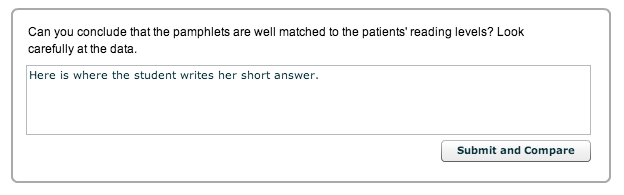
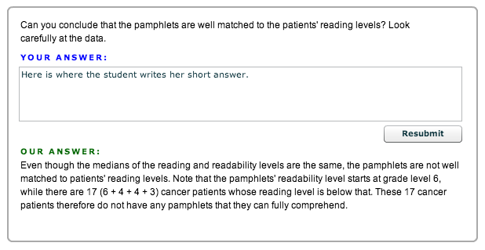
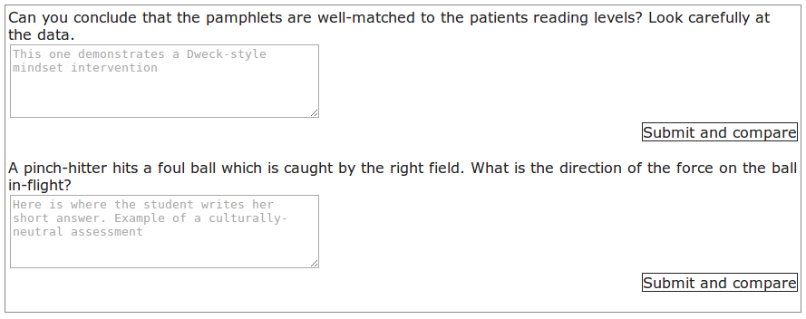
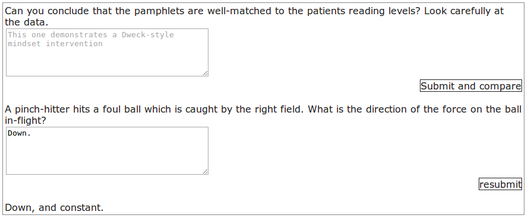

SelfCheckXBlock
===============

OLI-style check yourself XBlock. 

OLI had self-check questions: 

After a student submits: 

We build something similar, but ugly, for Open edX, in hopes someone cleans it up: 

After a student submits: 

We actually first built something like this back when edX was first
made. We thought we were the first MOOC provider to do this... Turns
out Google CourseBuilder did it probably a month or two prior. And OLI
did this a *very* long time prior to Google. I have no idea where that
code lives, so this is a clean rebuild.